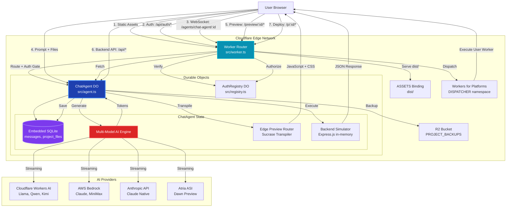

# BrainHalf — Architecture & Structure Map

**Generated**: September 17, 2026 (partially corrected September 28, 2026)
**Codebase**: `/home/kashifullah/brainhalf/`  
**Purpose**: Comprehensive architectural mapping of the BrainHalf platform

> **Accuracy note**: file counts and provider listings in code always win over this
> document. The model catalog is maintained only in `MODELS.md` / `src/lib/models.ts`.

---

## 1. Directory & Module Map

### Top-Level Structure

```
brainhalf/
├── src/                          # Core application source code
│   ├── components/              # React UI components (~50 files)
│   ├── lib/                     # Shared libraries and utilities
│   ├── assets/                  # Static assets (logos, images)
│   ├── __tests__/              # Vitest unit & integration tests (97 test files)
│   ├── agent.ts                # ChatAgent Durable Object (core business logic)
│   ├── worker.ts               # Cloudflare Worker entrypoint & router
│   ├── registry.ts             # AuthRegistry Durable Object (user/project mapping)
│   ├── App.tsx                 # Main React application shell
│   ├── main.tsx                # Vite/React entrypoint
│   └── index.css               # Global styles & design system
├── tests/                       # Playwright E2E & benchmark tests
├── dist/                        # Production build output (Vite bundle)
├── public/                      # Static assets served by ASSETS binding
├── wrangler.toml               # Cloudflare Workers configuration
├── package.json                # npm dependencies & scripts
├── vite.config.ts              # Vite build configuration
├── tsconfig.json               # TypeScript compiler configuration
└── playwright.config.ts        # E2E test runner configuration
```

### Component Responsibilities

#### **`src/components/` (UI Layer)**
| Component | Responsibility |
|---|---|
| `App.tsx` | Top-level container: auth gating, sidebar/workspace layout, session management |
| `ChatPanel.tsx` | AI chat interface: WebSocket connection, streaming tokens, model selector, message history |
| `Workspace.tsx` | Multi-panel code editor + preview: Monaco integration, isolated edge preview, split view, file tree |
| `TopNav.tsx` | Project identity, deploy modal, export actions, settings, user menu |
| `DashboardPage.tsx` / `RecentProjects.tsx` | Project list, creation, deletion, branch/merge operations |
| `LoginScreen.tsx` | Authentication UI: signup/login forms, credential validation |
| `FileExplorer.tsx` | File tree navigation with expand/collapse |
| `PreviewRunner.tsx` | Isolated preview iframe manager |
| `CodeFileBlock.tsx`, `DiffEditBlock.tsx`, `CommandBlock.tsx`, `PlanBlock.tsx` | Syntax-highlighted message segment renderers |
| `ConfirmModal.tsx` | Reusable confirmation dialog |
| `ErrorBoundary.tsx` | React error boundary for preview runtime |
| `BrainHalfLogo.tsx` | SVG logo component |

#### **`src/lib/` (Business Logic & Utilities)**
| Module | Responsibility |
|---|---|
| `events.ts` | Decoupled event bus (`appEvents`): cross-component communication |
| `project-store.ts` | LocalStorage + IndexedDB persistence for projects, files, messages |
| `message-parser.ts` | Parse AI output: `<file>`, `<edit>`, `<command>`, `<plan>` tags, markdown code blocks |
| `models.ts` | Model allowlist, token capping, timeout wrappers |
| `auth.ts` | Server-side auth: HMAC signature verification, rate limiting, ownership checks |
| `auth-client.ts` | Client-side auth: token storage, session verification, logout |
| `crypto.ts` | HMAC signing, password hashing (scrypt), secure token generation |
| `backend-runner.ts` | In-memory Express.js simulator for full-stack preview |
| `zip-export.ts` | JSZip project bundling |
| `github-export.ts` | GitHub repository creation via Octokit |
| `utils.ts` | Path normalization, bare module detection, security filters |
| `ssrf.ts` | SSRF protection: URL validation, allowlist checking |
| `concurrency.ts` | BusyLock, WriteEpoch, IdempotencyStore — prevent race conditions |
| `migrations.ts` | SQLite schema migration runner |
| `templates.ts` | Baseline React starter template |
| `status-store.ts` | Unified platform/project status tracking |
| `model-tester.ts` | Performance benchmark harness for `/api/test/*` endpoints |

#### **`src/agent.ts` (Durable Object — Core Engine)**
- **Embedded SQLite**: `messages`, `project_files`, `schema_version` tables
- **AI Streaming**: Multi-model router (Cloudflare Workers AI, AWS Bedrock, Anthropic, Atria)
- **Edge Preview Router**: On-the-fly Sucrase transpilation, dual-MIME CSS serving, ErrorBoundary mount harness
- **File Management**: Write guards, validation, secret filtering
- **Concurrency Control**: Busy locks, write epochs, idempotency tracking

#### **`src/worker.ts` (Edge Router)**
- **Static Assets**: `env.ASSETS` binding serves `dist/`
- **Authentication Endpoints**: `/api/auth/signup`, `/api/auth/login`, `/api/auth/logout`, `/api/auth/session`
- **Project Management**: `/api/projects` (list, PATCH, DELETE with ownership enforcement)
- **Preview Routing**: `/preview/:projectId/*` → ChatAgent DO
- **Dispatch Namespace**: `/p/:projectId/*` → Workers for Platforms deployment
- **Agent WebSocket**: `/agents/chat-agent/:projectId` → DO connection
- **Rate Limiting**: Fixed-window in-memory limiters for auth and model test endpoints

---

## 2. Request Flow: Prompt → Generation → Preview

### **User Journey: "Create a Kanban board"**

#### **Phase 1: Connection Establishment**
1. **Client** (`ChatPanel.tsx`): User authenticates → `LoginScreen.tsx` calls `/api/auth/login`
2. **Worker** (`worker.ts`): Verifies credentials → `handleLogin()` generates HMAC-signed JWT
3. **Response**: Session token stored in `localStorage`, user object in React state
4. **WebSocket Upgrade**: `wss://brainhalf.com/agents/chat-agent/:projectId?token=...`
5. **Worker**: `routeAgentRequest()` → `onBeforeConnect` verifies token → `verifySession()`
6. **AuthRegistry DO**: Checks signature + expiry → returns `{ userId, email }`
7. **Worker**: Calls `authorizeOrClaim()` → first access claims project for user
8. **ChatAgent DO**: `onConnect()` → runs `ensureSchema()` → `restoreFromR2()` → `seedStarterIfEmpty()`
9. **Response**: `{ type: 'history', data: [...messages] }` sent to client

#### **Phase 2: Generation**
10. **Client**: User types "Create a Kanban board" → clicks Send
11. **ChatPanel.tsx**: Emits `request-workspace-context` event
12. **Workspace.tsx**: Responds with current `filesRef.current` map
13. **ChatPanel.tsx**: Sends WebSocket message:
    ```json
    {
      "prompt": "Create a Kanban board",
      "projectId": "proj-xyz",
      "model": "@cf/meta/llama-3.3-70b-instruct-fp8-fast",
      "provider": "cloudflare",
      "workspaceFiles": { "/src/App.jsx": "...", ... }
    }
    ```
14. **ChatAgent DO** (`onMessage()`):
    - Validates authenticated connection (`connectionUserIds.has(connection.id)`)
    - Acquires `generationLock.acquire()` → rejects concurrent generations
    - Bumps `writeEpoch.next()` → marks generation start
    - Registers idempotency key → prevents duplicate processing
    - Resolves model via `resolveModel()` → `MODEL_ALLOWLIST` lookup
    - Builds context: `buildFilesContext()` → ranks files, excludes secrets
    - Calls AI provider:
      - **Cloudflare Workers AI**: `env.AI.run()` with token ladder `[65536, 32768, 16384, 8192]`
      - **AWS Bedrock**: `BedrockRuntimeClient.converseStream()` via `ai` SDK
      - **Anthropic**: `createAnthropic()` SDK client
15. **Streaming Response**: Tokens arrive via `data.chunk.response`
16. **ChatAgent DO**: Sends `{ type: 'stream', chunk: { response: "const [columns...", done: false } }`
17. **Client** (`ChatPanel.tsx`):
    - Buffers tokens: `bufferRef.current += text`
    - RAF-throttles state updates: `requestAnimationFrame()` batches ~16ms of tokens
    - Parses `<file path="...">...</file>` tags via `parseMessageSegments()`
    - Emits `file-generated` event with `{ path, content, isComplete: false }`
18. **Workspace.tsx**: Updates `filesRef.current`, triggers Monaco editor re-render
19. **Generation Complete**: `{ type: 'stream', chunk: { done: true } }`
20. **ChatAgent DO**: Calls `extractAndSaveFiles()`:
    - Validates syntax via `sucrase.transform()`
    - Rejects truncated/broken code → prevents corruption
    - Writes to SQLite: `INSERT OR REPLACE INTO project_files ...`
    - Backs up to R2: `backupToR2()` → `env.PROJECT_BACKUPS.put()`
21. **Client**: Final parse → `appEvents.emit('generation-status', { status: 'Ready' })`

#### **Phase 3: Edge Preview**
22. **Workspace.tsx**: Updates preview iframe `src`:
    ```
    https://brainhalf.com/preview/proj-xyz/index.html?name=...&token=...
    ```
23. **Worker**: `/preview/proj-xyz/index.html` → `authorizeOrClaim()` → ownership check
24. **ChatAgent DO** (`fetch()` handler):
    - Serves HTML shell with ES Module Import Maps:
      ```json
      {
        "imports": {
          "react": "https://esm.sh/react@18.2.0",
          "react-dom/client": "https://esm.sh/react-dom@18.2.0/client?external=react",
          "lucide-react": "https://esm.sh/lucide-react@0.344.0?external=react"
        }
      }
      ```
    - Injects Tailwind CSS CDN, global error listeners
25. **Browser**: Fetches `/preview/proj-xyz/src/main.jsx`
26. **ChatAgent DO**:
    - Reads from SQLite: `SELECT content FROM project_files WHERE path = '/src/main.jsx'`
    - Transpiles via `sucrase.transform(code, { transforms: ['typescript', 'jsx'] })`
    - Auto-fixes common typos (e.g. `Chat` → `MessageSquare` icon)
    - Serves as `Content-Type: application/javascript; charset=utf-8`
27. **Browser**: Executes transpiled code → mounts `<App />` inside `ErrorBoundary`
28. **CSS Imports**: `/preview/proj-xyz/src/styles.css` requested with `Sec-Fetch-Dest: script`
29. **ChatAgent DO**: Detects ES module import → serves dual-MIME JavaScript wrapper:
    ```javascript
    (function() {
      const id = 'bh-style-src-styles-css';
      let el = document.getElementById(id);
      if (!el) {
        el = document.createElement('style');
        el.id = id;
        document.head.appendChild(el);
      }
      el.textContent = cssContent;
    })();
    export default cssContent;
    ```
30. **Preview Rendered**: App UI visible in iframe

#### **Phase 4: Full-Stack Backend (Optional)**
31. **Generated Code**: Includes `/server/index.js`, `/server/routes/api.js`, `/server/db.js`
32. **Workspace.tsx**: Detects `isFullStackProject()` → shows "Backend" tab
33. **Preview Runtime**: Fetch interceptor patches `/api/*` calls:
    ```javascript
    window.fetch = function(input, init) {
      if (url.startsWith('/api/')) {
        const base = window.location.pathname.replace(/(\\/index\\.html.*|\\/src\\/.*|\\/)?$/, '');
        input = base + url;  // Rewrite to /preview/proj-xyz/api/...
      }
      return origFetch.call(this, input, init);
    };
    ```
34. **Browser**: `fetch('/api/items')` → rewritten to `/preview/proj-xyz/api/items`
35. **ChatAgent DO** (`onRequest()`):
    - Detects `/preview/:id/api/*` path
    - Calls `executeBackendRequest()`:
      - Parses Express.js routes from `/server/` files
      - Executes in-memory via `InMemoryDataStore` (per-DO singleton)
      - Returns JSON response
36. **Client**: Receives data, renders UI

---

## 3. External Dependencies & Bindings

### **Cloudflare Platform**
| Binding | Type | Usage |
|---|---|---|
| `ChatAgent` | Durable Object | Project-isolated SQLite storage, AI streaming, edge preview runtime |
| `AuthRegistry` | Durable Object | User authentication, project ownership mapping, session management |
| `AI` | Workers AI | Edge-native LLM inference (`@cf/meta/llama-3.3-70b-instruct-fp8-fast`, etc.) |
| `ASSETS` | Asset Binding | Serves static frontend bundle (`dist/`) with strict cache headers |
| `PROJECT_BACKUPS` | R2 Bucket | Automatic workspace backups on generation |
| `DISPATCHER` | Dispatch Namespace | Workers for Platforms: user-deployed scripts at `/p/:projectId` |

### **External AI Providers**
| Provider | SDK | Models |
|---|---|---|
| **AWS Bedrock** | `@ai-sdk/amazon-bedrock` | `claude-opus-4.6`, `claude-sonnet-4.6`, `minimax-m2.5` |
| **Anthropic (Native)** | `@ai-sdk/anthropic` | `claude-3-7-sonnet`, `claude-3-5-sonnet` |
| **Atria ASI** | `@ai-sdk/openai` (OpenAI-compatible API) | `Atria-Dawn-Preview` |
| **Cloudflare Workers AI** | `env.AI.run()` | 7 edge-native models (Llama, Qwen, GPT-OSS, Kimi) |

### **npm Dependencies (Core)**
| Package | Purpose | Version |
|---|---|---|
| `react` | UI framework | 19.2.8 |
| `react-dom` | React DOM renderer | 19.2.8 |
| `@monaco-editor/react` | Code editor component | 4.7.0 |
| (removed) | Sandpack virtual bundler was removed; the isolated edge preview is the only engine |
| `agents` | Cloudflare Durable Objects SDK | 0.22.0 |
| `ai` | Vercel AI SDK (multi-provider streaming) | 7.0.97 |
| `sucrase` | Ultra-fast TypeScript/JSX transpiler | 3.35.1 |
| `jszip` | ZIP export generation | 3.10.2 |
| `lucide-react` | Icon library | 1.43.0 |
| `zod` | Schema validation | 4.6.2 |
| `prismjs` | Syntax highlighting | 1.30.0 |

### **Build & Test Dependencies**
- **Vite** `8.2.2` — Frontend bundler
- **TypeScript** `7.0.2` — Type safety
- **Vitest** `5.0.0` — Unit test runner (61 tests)
- **Playwright** `1.63.0` — E2E test automation
- **Oxlint** `1.79.0` — Fast linter

---

## 4. System Architecture Diagram



### **Data Flow Summary**
1. **Static Assets**: Worker → ASSETS binding → Browser
2. **Authentication**: Browser → Worker → AuthRegistry DO → JWT token
3. **WebSocket Connection**: Browser → Worker (auth gate) → ChatAgent DO
4. **AI Generation**: User prompt → ChatAgent DO → AI Provider → Streaming tokens → SQLite → Browser
5. **Edge Preview**: Browser → Worker (ownership check) → ChatAgent DO → Sucrase → Transpiled code → Browser
6. **Backend API**: Browser → ChatAgent DO → In-memory Express.js → JSON response
7. **Deployment**: Browser → Worker → Dispatcher namespace → User-deployed Worker

---

## 5. Architectural Inconsistencies & Issues

### **❌ Critical: Business Logic Leaking into Frontend**
**Location**: `src/components/ChatPanel.tsx`, `src/components/Workspace.tsx`

**Issue**: Complex file parsing, edit application, and state synchronization logic lives in React components rather than in reusable libraries.

**Examples**:
- **File parsing**: `ChatPanel.tsx` lines 200-280 — `parseMessageSegments()` called inline, buffers managed in refs
- **Edit application**: `message-parser.ts` (good) vs. `ChatPanel.tsx` duplicating logic
- **File synchronization**: `Workspace.tsx` maintains `filesRef.current`, `commitFiles()`, manual sync with DO

**Impact**: Code duplication, difficult testing, logic scattered across UI and lib.

**Fix**: Extract to `src/lib/workspace-sync.ts` with clear API:
```typescript
class WorkspaceSync {
  private files: FileMap;
  private ws: WebSocket;
  
  commitFiles(next: FileMap): void { /* unified logic */ }
  syncToDO(): Promise<void> { /* WebSocket sync */ }
}
```

### **❌ Medium: Presentation Logic in Backend (Durable Object)**
**Location**: `src/agent.ts` lines 300-450

**Issue**: The ChatAgent DO constructs HTML shell markup, injects CSS CDN links, and generates JavaScript wrappers for CSS imports — all presentation concerns.

**Impact**: Tight coupling between preview runtime and storage layer, difficult to update preview UX without DO deployment.

**Fix**: Move HTML template to `src/lib/preview-template.ts`, let DO serve parameterized content.

### **❌ Medium: Duplicate Storage Layers**
**Location**: `src/lib/project-store.ts`

**Issue**: Files are persisted in **three** places:
1. LocalStorage (`localStorage.setItem()`)
2. IndexedDB (`idbSet()`)
3. Durable Object SQLite (via WebSocket `sync_files`)

**Impact**: Inconsistent state, race conditions, unclear source of truth.

**Example**: `saveProjectFiles()` writes to localStorage (sync), IDB (async), and emits `sync-files` event. A failure in any layer leaves the workspace in an inconsistent state.

**Fix**: Single write path through DO → R2, client cache read-only.

### **❌ Low: Mixed Error Handling Styles**
**Locations**: Throughout codebase

**Patterns Found**:
- **Throw errors**: `src/lib/ssrf.ts` `safeFetchText()` throws on SSRF violations
- **Return null**: `src/lib/models.ts` `resolveModel()` returns `null` for unknown models
- **Silent catch**: `src/components/Workspace.tsx` `copyText()` catches and returns `false`
- **Event-based**: `appEvents.emit('generation-status', { status: 'Error', error: ... })`

**Impact**: Inconsistent caller expectations, some errors swallowed, others crash.

**Fix**: Document error contract per module:
- **Lib layer**: Throw typed errors (`class ModelNotFoundError extends Error`)
- **Component layer**: Catch and emit events or show UI feedback
- **DO layer**: Log + return error responses, never throw to Worker

### **❌ Low: Inconsistent Naming Conventions**
**Examples**:
- **PascalCase Components**: `ChatPanel.tsx`, `Workspace.tsx` (correct)
- **camelCase Functions**: `getProjects()`, `saveProjectFiles()` (correct)
- **kebab-case Files**: Some test files use `ai-ide-e2e-001-lifecycle.spec.ts` vs. `auth-gate.test.ts`
- **Mixed Event Names**: `file-generated` (kebab) vs. `workspaceFilesChanged` (camel) in `appEvents`

**Impact**: Cognitive load, harder to grep/refactor.

**Fix**: Enforce in ESLint config:
- Components: PascalCase
- Functions/variables: camelCase
- Files: Match export (Component → PascalCase.tsx, function → camelCase.ts)
- Events: kebab-case only

---

## 6. Layering Summary

| Layer | Responsibility | Files |
|---|---|---|
| **Presentation** (Client) | React UI, user interactions, visual feedback | `src/components/*`, `src/App.tsx` |
| **State Management** (Client) | LocalStorage, IndexedDB, event bus | `src/lib/project-store.ts`, `src/lib/events.ts` |
| **Business Logic** (Edge DO) | AI generation, file validation, transpilation, backend simulation | `src/agent.ts`, `src/registry.ts` |
| **Routing & Auth** (Edge Worker) | Request routing, CORS, rate limiting, session verification | `src/worker.ts`, `src/lib/auth.ts` |
| **Utilities** (Shared) | Parsing, validation, crypto, path normalization | `src/lib/message-parser.ts`, `src/lib/crypto.ts`, `src/lib/utils.ts` |
| **External** | AI providers, R2 storage, Dispatch namespace | Cloudflare bindings, AWS SDK, Anthropic SDK |

---

**End of ARCHITECTURE.md**
