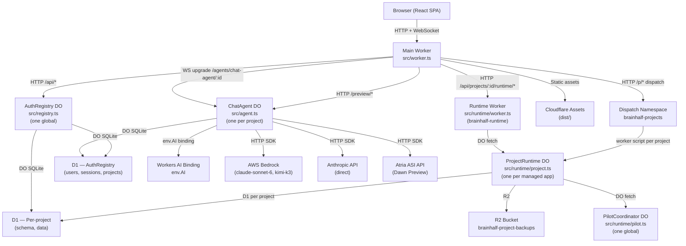
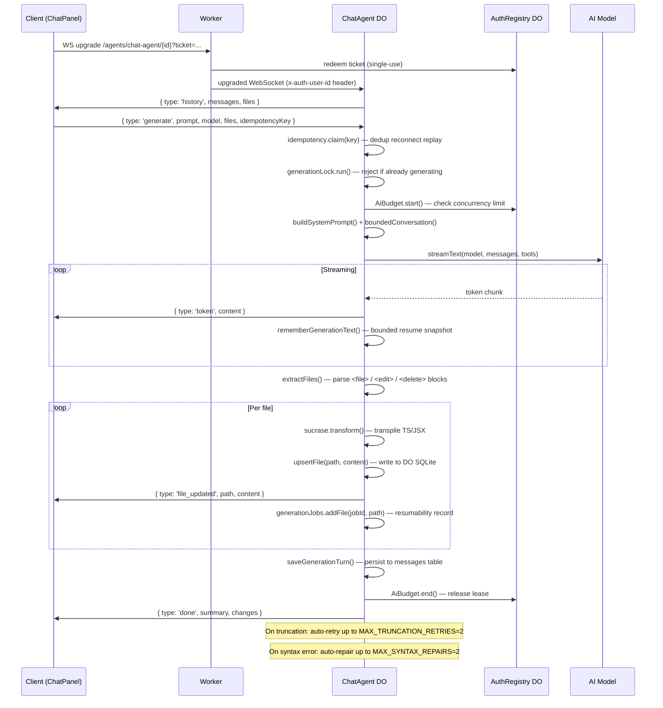

# BrainHalf — Complete Codebase Knowledge Document

> **Purpose:** Self-contained reference for any LLM or engineer implementing features, fixing bugs, or refactoring.
> **Last Updated:** 2026-10-05 (post-bugfix pass — all 15 bugs listed in §17 have been resolved)
> **Scope:** All source under `src/`, `scripts/`, `runtime-tests/`, config files at root.
> **Excluded:** `node_modules/`, `dist/`, `.wrangler/`, `.git/`, test screenshots/audit artifacts.
> **Test status:** 1,579 tests pass · 0 TypeScript errors (both `tsconfig.json` and `tsconfig.runtime.json`)

---

## TABLE OF CONTENTS

1. [High-Level Overview](#1-high-level-overview)
2. [System Architecture](#2-system-architecture)
3. [Data Flow & Request Lifecycle](#3-data-flow--request-lifecycle)
4. [Core Components Deep Dive](#4-core-components-deep-dive)
   - 4.1 Main Worker (`src/worker.ts`)
   - 4.2 ChatAgent Durable Object (`src/agent.ts`)
   - 4.3 AuthRegistry Durable Object (`src/registry.ts`)
   - 4.4 Runtime Worker (`src/runtime/worker.ts` + `src/runtime/project.ts`)
   - 4.5 Frontend App (`src/App.tsx`, `src/main.tsx`)
   - 4.6 ChatPanel (`src/components/ChatPanel.tsx`)
   - 4.7 Workspace (`src/components/Workspace.tsx`)
5. [Feature Catalog](#5-feature-catalog)
   - 5.1 AI App Generation
   - 5.2 Live Preview System
   - 5.3 Authentication & Session Management
   - 5.4 Project Management
   - 5.5 Managed Runtime (Full-Stack Hosting)
   - 5.6 Publication & Deployment
   - 5.7 Gallery & Remix
   - 5.8 GitHub Sync & Export
   - 5.9 Builder Tools (MCP, Skills, Attachments)
   - 5.10 Admin Console
   - 5.11 SEO & Public Pages
6. [Database Schemas](#6-database-schemas)
   - 6.1 ChatAgent SQLite (per-project)
   - 6.2 AuthRegistry SQLite (global)
   - 6.3 Runtime SQLite (per-project, separate worker)
7. [AI Generation Pipeline](#7-ai-generation-pipeline)
8. [Authentication Deep Dive](#8-authentication-deep-dive)
9. [Preview System Deep Dive](#9-preview-system-deep-dive)
10. [Product Limits & Quotas](#10-product-limits--quotas)
11. [Environment Variables & Bindings](#11-environment-variables--bindings)
12. [Cross-Cutting Concerns](#12-cross-cutting-concerns)
13. [Things You Must Know Before Changing Code](#13-things-you-must-know-before-changing-code)
14. [API Reference](#14-api-reference)
15. [Glossary](#15-glossary)
16. [File Index & Dependency Map](#16-file-index--dependency-map)
17. [Bug Fix Changelog](#17-bug-fix-changelog)

---

## 1. HIGH-LEVEL OVERVIEW

### What is BrainHalf?

BrainHalf is an **AI-powered web application builder for small businesses**, deployed entirely on Cloudflare's edge infrastructure. Users describe what they want ("a booking app for my hair salon") and an AI agent generates a working full-stack application — React frontend + Cloudflare Workers backend + D1 database — live-previewed in the browser and publishable with one click.

### Target Users
- Non-technical small business owners who want custom internal tools
- Developers who want to scaffold and iterate apps quickly
- Operators/admins who manage the platform

### Core Features

| Feature | Business Purpose |
|---------|-----------------|
| AI App Generation | Convert a text description to a working web app |
| Live Preview | See changes as they stream from the model |
| Managed Hosting | One-click deploy to `brainhalf.com` subdomain |
| Full-Stack Runtime | Real Workers backend + D1 database per project |
| Auth Management | Sign-in/OAuth/email built into every generated app |
| Gallery & Remix | Discover and fork public apps |
| GitHub Export | Take ownership of generated source code |
| Admin Console | Platform operator management |

### Architecture Type

- **Monorepo, single Cloudflare deployment** (`brainhalf` worker)
- **Separate runtime worker** (`brainhalf-runtime`) for managed app hosting
- **Two Durable Objects:** `ChatAgent` (per-project state) and `AuthRegistry` (global user/session store)
- **Vite SPA frontend** served as static assets, enhanced by the Worker for auth-gated routes
- **No traditional server** — everything runs on Cloudflare Workers

---

## 2. SYSTEM ARCHITECTURE



### Key Architectural Facts

1. **Two deployed workers:** `brainhalf` (main) and `brainhalf-runtime`. Separate deployments, share some code via import.
2. **ChatAgent = one DO per project.** Identified by `projectId` (e.g., `proj-<uuid>`). Holds: all project files, chat history, generation state, builder attachments, MCP configs.
3. **AuthRegistry = one global DO.** Named `'auth'`. Holds: users, sessions, project ownership, AI budget ledger, gallery, custom models, rate-limit windows.
4. **Hibernation is used.** The ChatAgent's WebSocket connections use Cloudflare's hibernation API to avoid billing idle time. `connectionUserIds` is rebuilt from the WS header on wake.
5. **Frontend is a pure SPA.** Routing is done client-side in `src/main.tsx` by checking `window.location.pathname`. There is no React Router — the URL is manipulated via `history.pushState`.
6. **Preview runs in a sandboxed iframe.** The preview HTML is generated by the Worker and served from the same origin; the iframe has `sandbox="allow-scripts allow-forms allow-popups"` (no `allow-same-origin`), creating an opaque origin so preview code cannot access the parent's cookies or localStorage.

---

## 3. DATA FLOW & REQUEST LIFECYCLE

### A. Initial Page Load

```
Browser → GET / → Main Worker → run_worker_first check
  → ASSETS.fetch(index.html) + shellSecurityHeaders()
  → Browser hydrates React from pre-rendered HTML (or fresh createRoot)
  → src/main.tsx: checks pathname, selects component, hydrateRoot or createRoot
```

### B. User Authentication (Login)

```
LoginScreen → POST /api/auth/login → Worker → handleLogin() → AuthRegistry DO
  → verifyPassword(PBKDF2) → issueToken(HMAC-SHA256, 30-day TTL)
  → Set-Cookie: bh_session (httpOnly, Secure, SameSite=Lax)
  → localStorage.setItem('bh_session_token', token)
  → GET /api/projects → Worker → AuthRegistry → project list
  → reconcileOwnedProjects() → localStorage project cache
```

### C. AI Generation (Core Flow)

```
ChatPanel → WebSocket /agents/chat-agent/{projectId}?idempotencyKey=...&ticket=...
  → Worker onBeforeConnect → verify ticket/session → isProjectOwner → injectUserId
  → ChatAgent.onConnect() → connectionUserIds.set(connId, userId)
  → Client sends: { type: 'generate', prompt, model, files }
  → ChatAgent.onMessage() → idempotency.claim(key) → generationLock.run(...)
    → AiBudget.start() → reserve tokens in AuthRegistry
    → buildSystemPrompt() → bound conversation context
    → resolveModel() → selectModelTransport() → create provider client
    → streamText(model, messages, tools) → stream tokens to client via WS
    → Per token: ws.send({ type: 'token', content })
    → Per <file path=...>: extract, transpile (sucrase), upsertFile()
    → On finish: saveGenerationTurn() → AiBudget.end()
    → ws.send({ type: 'done', summary })
```

### D. Preview Rendering

```
Workspace → /preview/{projectId}/index.html → Worker
  → verifyPreviewSession() → checkPreviewAccess() (owner OR published)
  → ChatAgent /preview/{id}/api/files → previewFiles(files, owner)
  → isolatedPreviewHtml(projectId, filteredFiles)
  → iframe loads: preview-runtime.js bootstraps React app
  → fetch('/api/*') inside iframe → same-origin → Worker unmatched API handler
    → Referer check → ChatAgent → InMemoryDataStore simulated backend
```

### E. Managed Runtime Proxy

```
Frontend → POST /api/projects/:id/runtime/:path → Worker
  → verifySession() → isProjectOwner()
  → Build headers: { x-bh-project, x-bh-owner }
    + forward original Content-Type (not hardcoded)
    + forward x-file-name, content-disposition if present
    + x-bh-unlimited if operator
  → env.RUNTIME.fetch(target, { method, headers, body })
  → ProjectRuntime DO handles the request
```

### F. Publish Flow

```
PublishPopover → POST /api/projects/{id}/runtime/deploy → Worker → Runtime
  → ProjectRuntime.deploy() → pnpm build → pnpm test → verify (brainhalf.verify.json)
  → Cloudflare D1 migrations → script upload to dispatch namespace
  → PilotCoordinator.register(alias, scope)
  → Worker /p/{alias} → DISPATCHER.get(alias).fetch()
```

---

## 4. CORE COMPONENTS DEEP DIVE

### 4.1 Main Worker — `src/worker.ts` (1056 lines)

**Entry point for all HTTP traffic.** Handles:

- **www redirect:** `www.brainhalf.com` → `brainhalf.com` (301)
- **CORS preflight:** `/api/`, `/agents/`, `/preview/`, `/p/` prefixes
- **Auth routes** (`/api/auth/*`): signup, login, logout, session, ws-ticket, Google OAuth, email verification, forgot/reset password, contact
- **Admin routes** (`/api/admin/*`): users list/delete, projects list/delete/files/preview, model management, settings, email status — all gated by `isOperator()`
- **Account routes** (`/api/account/*`): AI usage, deletions, project quota
- **Project routes** (`/api/projects/*`): list, stop, delete, patch (rename), showcase, remix, publication
- **Runtime proxy** (`/api/projects/:id/runtime/*`): authenticated passthrough to `brainhalf-runtime` service binding. **Forwards original Content-Type and file headers** (not hardcoded `application/json`).
- **Static preview** (`/preview/:id/*`): serve isolated preview HTML or file assets from ChatAgent
- **Deployed app** (`/p/:slug/*`): `DISPATCHER.get(slug).fetch()` → dispatch namespace worker
- **Agent WebSocket** (`/agents/chat-agent/:id`): `routeAgentRequest` with `onBeforeConnect` auth
- **Fallback unmatched `/api/`**: Referer-based preview API proxy to ChatAgent
- **Shell HTML** (`/`, `/dashboard`, `/admin`, etc.): `ASSETS.fetch` + `shellSecurityHeaders()`

**Key functions:**
- `isOperator(env, user)` — checks `PRODUCT_METRICS_OWNER_IDS` env var OR `ADMIN_EMAILS`
- `checkRateLimit(env, bucket, key)` — delegates to AuthRegistry DO
- `corsHeaders(origin)` — reflects allowlisted origin only (localhost only when `_isDev` is true, set from `env.IS_DEV` at request start)
- `withShellSecurity(response)` — attaches full CSP, HSTS, COEP, COOP headers
- `withPreviewPrivacy(response)` — strips cookies, sets preview-specific CSP
- `authorizeOrClaim(env, projectId, userId, url)` — verifies ownership OR creates project if new

**Per-request dev flag:**
```typescript
// Set at the very start of each fetch(), before any CORS logic
_isDev = Boolean(env.IS_DEV);
```
This module-level variable is safe because Cloudflare Workers are single-threaded per isolate.

### 4.2 ChatAgent Durable Object — `src/agent.ts` (3936 lines)

**Central state machine for one project.** Extends `Agent` from the `agents` SDK.

**SQLite tables (via AGENT_MIGRATIONS, 12 versions):**
- `messages` — chat history (role, content, created_at)
- `project_files` — workspace files (path PRIMARY KEY, content, updated_at)
- `project_file_revision` — monotonic counter, auto-incremented by triggers
- `source_history` — checkpoints (source snapshots for undo/restore)
- `generation_usage` — per-generation accounting (tokens, timing)
- `generation_jobs` — resumable generation records
- `idempotency_keys` — WS reconnect deduplication
- `builder_attachments` + `builder_attachment_chunks` — uploaded files
- `builder_mcp` — MCP server configs (encrypted tokens)
- `builder_skills` — user-defined skill instructions
- `product_outbox` — pending product event emissions
- `oauth_flows` — OAuth state tokens (managed-app Google/GitHub flows)

**Key instance fields:**
- `connectionUserIds: Map<string, string>` — WS connection ID → verified userId (**wiped on hibernation — re-populated from `x-auth-user-id` header on reconnect**)
- `generationLock: BusyLock` — prevents concurrent generations
- `writeEpoch: WriteEpoch` — stale write detection
- `idempotency: IdempotencyStore` — deduplicates reconnect replays
- `previewStore: InMemoryDataStore` — per-project simulated backend state
- `activeGeneration: GenerationSession | null` — live streaming snapshot for reconnect
- `truncationRetries`, `syntaxRepairAttempts`, `finalCompletenessRepairAttempts` — auto-repair loop counters (**reset on new user prompt at line 1714**)
- `backendReadyCache` — TTL cache for runtime readiness probe

**HTTP routes handled by onRequest:**
- `GET /preview/:id/api/files` — project files (filtered by `isBlockedSecretFile`)
- `GET /preview/:id/api/sync` — workspace diff (owner-only)
- `POST /preview/:id/api/sync` — workspace write (owner-only, revision-safe)
- `GET /preview/:id/api/files/snapshot*` — paginated file snapshot
- `GET /preview/:id/api/history*` — source checkpoints
- `POST /preview/:id/api/history` — create checkpoint
- `GET /preview/:id/api/generation` — active generation snapshot (for reconnect)
- `GET /preview/:id/*` (static files) — serve from project_files
- `POST /agents/chat-agent/:id/*` — builder endpoints (attachments, MCP, skills)
- `GET /internal/admin-files` — operator file inspection
- `POST /internal/remix-export` / `POST /internal/remix-import` — gallery remix
- `POST /internal/stop` — stop generation
- `GET /internal/context` — workspace context for generation

**WebSocket message types (client → server):**
- `generate` — start AI generation with prompt, model, files
- `sync_files` — push workspace changes from editor
- `snapshot_chunk_ack` — acknowledge a file snapshot chunk
- `get_history` — fetch older messages (pagination)
- `request_context` — request workspace context for a generation
- `ping` — keepalive

**WebSocket message types (server → client):**
- `history` — initial chat history + files + workspace sync mode
- `token` — streaming AI text
- `status` — generation status update
- `file_updated` / `file_deleted` — workspace change notifications
- `files_snapshot` / `files_snapshot_chunk` / `files_snapshot_done` — full workspace push
- `sync_ack` / `sync_conflict` — workspace sync responses
- `generation_interrupted` — resumable job info
- `done` — generation complete with summary
- `error` — generation failure
- `usage` — token counts after generation
- `ping` / `pong`

### 4.3 AuthRegistry Durable Object — `src/registry.ts` (1247 lines)

**Global singleton** (`idFromName('auth')`). All HTTP routes are internal — only reached via DO fetch from `worker.ts`.

**Responsibilities:**
- User CRUD (create, read) with PBKDF2-hashed passwords
- Session lifecycle (issue, verify hash, revoke)
- Project ownership (register, lookup, delete, list, quota)
- Rate limiting (fixed-window, per-bucket per-key)
- AI budget ledger (per-owner, separate DO instance `ai-budget:{ownerId}`)
- Google OAuth flow state storage
- Gallery management (showcase, list)
- Custom model CRUD + AES-GCM encrypted API keys using **`MODEL_KEY_SECRET` only** (no fallback to `SESSION_SECRET`)
- Admin settings (integrated models toggle, disabled model list)
- Session TTL sweep (alarm-based cleanup)
- Publication status (per-project published flag)
- WS ticket issuance and redemption (single-use, 60s TTL)

**Important internal routes:**
- `POST /auth/signup` — create user
- `POST /auth/login` — verify password, create session
- `DELETE /auth/logout` — delete session row
- `GET /auth/session` — verify session token hash
- `GET /rate-limit/check` — rate limit check+increment
- `GET /projects?userId=` — list owned projects (capped at `MAX_PROJECT_ROWS_PER_USER`)
- `POST /projects` — register project ownership
- `DELETE /projects/:id?userId=` — delete project + ownership
- `GET /projects/access?projectId=&userId=` — preview access check (owner/published)
- `GET /projects/publication?projectId=&userId=` / `PUT` — get/set published flag
- `GET /gallery` — public showcase listing
- `PUT /projects/showcase?projectId=&userId=` — toggle showcase
- `POST /ws-tickets` / `DELETE /ws-tickets/:ticket` — single-use WS auth
- `POST /admin/models` / `GET /admin/models` / `DELETE /admin/models/:id` — custom model CRUD
- `GET /admin/users` / `DELETE /admin/users/:id` — user management
- `GET /admin/projects` / `DELETE /admin/projects/:id` — project management
- `GET /admin/settings` / `POST /admin/settings` — model enable/disable toggle
- `GET /public/model-status` — unauthenticated model toggle status
- `GET /outcomes` — generation outcome metrics
- `GET /ai/usage` — current user's AI budget

### 4.4 Runtime Worker — `src/runtime/worker.ts` + `src/runtime/project.ts`

A **separate Cloudflare Worker** (`brainhalf-runtime`) that manages the full-stack hosting side.

**Entry class:** `RuntimeControl extends WorkerEntrypoint` — reached only via authenticated service binding `env.RUNTIME`.

**Routes:**
- `GET /provisioning-check` — pilot/CF API connectivity (pilot owner only)
- `POST /stop` — stop running project jobs
- `POST /unregister` — release pilot slot on project delete
- `POST /hosted/sweep` — release stale slots for deleted projects
- `POST /delete` — full project teardown (pilot unregister, R2 cleanup, quota release)
- `GET /status?environment=` — project runtime status
- `POST /jobs` — start a new job (build, preview, verify, deploy, publish)
- `GET /jobs/:id` — job status
- `GET /logs/:jobId` — build/deploy logs
- All other paths — forwarded to `ProjectRuntime` DO

**`ProjectRuntime` DO** (`src/runtime/project.ts`, 1346 lines):
- Manages Cloudflare Sandbox processes (pnpm install, pnpm build, pnpm test)
- **Dependency install retry:** detects ERESOLVE/strict-peer-dep errors and retries with `pnpm install --no-strict-peer-dependencies`
- Runs D1 migrations via Cloudflare D1 API (`src/runtime/cloudflare-api.ts`)
- Deploys Worker scripts to dispatch namespace via Cloudflare API
- Manages R2 backups (per-revision source archives)
- Serves development preview URL via Sandbox ingress
- Exposes heartbeat endpoint for lease renewal
- Runs `brainhalf.verify.json` verification steps (request, database, browser assertions)

**`PilotCoordinator` DO** (`src/runtime/pilot.ts`):
- Tracks which projects have a hosted app slot
- `register(alias, scope)` — claim a slot (enforces `MAX_HOSTED_APP_SPACES = 10`)
- `unregister(alias, scope)` — release a slot
- `releaseUnknown(ownerId, keep)` — GC stale slots
- `listOwnerProjects(ownerId)` — **batched storage.get** (not sequential per-key reads)

### 4.5 Frontend App — `src/App.tsx` (602 lines) + `src/main.tsx` (50 lines)

**`src/main.tsx`** is the Vite entry point. It:
1. Checks `window.self === window.top` — prevents the app shell from loading inside iframes (preview runtime uses `src/preview-main.tsx` instead)
2. Routes by `window.location.pathname`:
   - `/` or `/dashboard` → `<App />`
   - `/gallery` → `<GalleryPage />`
   - `/admin` → lazy `<AdminPage />`
   - `/forgot-password`, `/reset-password`, etc. → `<AccountPage />`
   - Everything else → `<PublicPage />`
3. Decides `hydrateRoot` vs `createRoot` based on `root.dataset.prerendered`

**`src/App.tsx`** is the main authenticated shell. It manages:
- Global auth state (`user`, `authChecked`)
- View routing: `'landing'` | `'dashboard'` | `'workspace'`
- Active project ID (synced to URL `?project=`)
- Project creation locking (prevents double-submit)
- Workspace exit confirmation (stops generation before navigating away)
- Chat panel width resize handle
- Google OAuth completion flow
- Session expiry cross-tab synchronization

### 4.6 ChatPanel — `src/components/ChatPanel.tsx` (2957 lines)

The primary user interface for AI interaction. Manages the full WebSocket lifecycle.

**Responsibilities:**
- WebSocket connect/reconnect with exponential backoff
- Single-use WS ticket authentication (prefetched via `prefetchWsTicket()`)
- Streaming token display
- File snapshot sync (v2 protocol with revision tracking)
- Chat history pagination
- Model picker (reads `/api/models/status`, filters by admin toggles)
- File attachment upload/management
- Generation resumability UI (Resume button for interrupted jobs)
- Workspace conflict resolution modal
- Auto-send for landing page `initialPrompt`
- Copy message, edit message, regenerate actions
- RAF-throttled token flush (avoids per-token renders)

**WebSocket reconnection:**
- Uses `connectAttempts` counter with `WS_RECONNECT_BACKOFF_CAP` ceiling
- `forceReconnectRef` allows "Reconnect & try again" from the recovery card
- Idempotency key prevents replay on reconnect

**`prefetchWsTicket()`:** Prefetches the single-use WS ticket and stores the promise in `prefetchedTicket`. The catch handler correctly captures the promise reference identity before attaching, so a second prefetch call doesn't get cleared if the first one fails late.

**Workspace sync protocol (v2):**
- Client maintains a `serverRevision` number
- Every file write includes `{ expected_revision }` for optimistic concurrency
- Server responds with `sync_ack` (new revision) or `sync_conflict`
- File snapshot uses `FileSnapshotAssembler` to handle chunked transfers

### 4.7 Workspace — `src/components/Workspace.tsx` (2030 lines)

The right-hand panel of the IDE, containing:
- **Monaco editor** (with TypeScript support, syntax highlighting, diff view)
- **Preview panel** (LivePreviewFrame for local preview, PreviewCanvas iframe)
- **Console/logs** (`ProjectConsole`)
- **Terminal** (lazy-loaded, xterm.js)
- **Build progress** (`BuildProgress`, `GenerationProgress`)
- **TopNav** (embedded, Bolt-style unified topbar)
- **File explorer** (`FileExplorer`, `ProjectFiles`)
- **Action menu** (publish, GitHub sync, export, project settings)

**Monaco worker fallback:** The blob URL created by `configureMonacoWorkerFallback()` is now properly revoked on `pagehide` to prevent a memory leak.

Preview rendering logic:
1. If runtime is active → `LivePreviewFrame` (embedded iframe to `/preview/{projectId}`)
2. Else → `PreviewCanvas` with `PreviewRunner` component (in-browser sucrase transpilation)

---

## 5. FEATURE CATALOG

### 5.1 AI App Generation

**Entry points:**
- User types in `ChatPanel` textarea and clicks Send
- Landing page `handleSubmitInitialPrompt` → auto-sends after project creation
- "Resume" button for interrupted jobs

**Technical flow:**
1. `ChatPanel.handleSendMessage()` → waits for workspace sync → sends `{ type: 'generate', prompt, model, files, attachmentIds }` over WS
2. `ChatAgent.onMessage()`:
   a. `idempotency.claim(idempotencyKey)` — dedup
   b. **Prompt classification** (`src/lib/prompt-mode.ts`):
      - `isConversationalPrompt` → pure chat, no file ops
      - `isDestructivePrompt` → tool-less mode (no writes without confirmation)
      - `isQuestionPrompt` → answer without file ops
      - `shouldAutoPlannerMode` → planning response only
      - `shouldUseStagedPipeline` → frontend-first then backend
   c. `AiBudget.start(id)` — check/reserve concurrent slot in AuthRegistry
   d. `buildSystemPrompt(opts)` — assembles 300-line system prompt with execution target context, write-order rules, migration rules, auth/email API documentation
   e. `boundedConversation(messages, contextLimit)` — trims history to model context window
   f. `prepareCapabilities(service, attachmentIds, signal, ...)` — builds agent tools
   g. `resolveModel()` → `selectModelTransport()` → create provider client
   h. `runCapabilityLoop()` or direct `streamText()` depending on tools
   i. Stream tokens to all connected clients via `ws.send({ type: 'token', content })`
   j. Parse `<file path="...">content</file>` blocks → `upsertFile()` → broadcast `file_updated`
   k. Parse `<edit path="..."><search>...</search><replace>...</replace></edit>` → `applyExactEdits()`
   l. Parse `<delete path="..." />` → delete file
   m. On complete: `saveGenerationTurn()`, emit `{ type: 'done', summary }`

**Auto-repair loops (all capped):**
- **Truncation retry** (max 2): If response ends mid-file-block → send `TRUNCATION_RETRY_MESSAGE` continuation
- **Syntax repair** (max 2): If generated JS/TS fails sucrase parse → regenerate broken files
- **Completeness repair** (max 1): After generation, find dangling imports → request missing files

**Token ladder (Cloudflare AI only):**
`[32768, 16384, 8192, 4096]` — stepped down on token-limit errors.

**Model providers:**
- `cloudflare` — `env.AI` binding (Workers AI)
- `aws` (Bedrock) — `@ai-sdk/amazon-bedrock`, credentials from env
- `anthropic` — `@ai-sdk/anthropic`, `ANTHROPIC_API_KEY` env
- `atria` — custom OpenAI-compatible endpoint, `ATRIA_API_KEY` + `ATRIA_BASE_URL`
- `custom` — admin-configured via registry, encrypted API key (requires `MODEL_KEY_SECRET`)

### 5.2 Live Preview System

**Two modes:**

**Mode A: In-browser preview (PreviewRunner / PreviewCanvas)**
- `src/components/PreviewCanvas.tsx` hosts an `<iframe>` with `PREVIEW_SANDBOX`
- `src/lib/preview-runtime.ts` (bundled as `dist/preview-runtime.js`) runs in the iframe:
  - Uses `new Function()` to execute sucrase-transpiled modules
  - Maintains a module registry; re-executes changed modules on update
  - Intercepts `fetch('/api/*')` → forwards to `createPreviewFetch()` → `InMemoryDataStore`
- `src/lib/preview-module-transform.ts` — transpiles TypeScript/JSX, rewrites bare imports to esm.sh URLs

**Mode B: Server-rendered preview (LivePreviewFrame)**
- Used when managed runtime is active and dev build is running
- `<iframe src="/preview/{projectId}/">` — auth via httpOnly cookie
- Worker fetches files from ChatAgent, injects into `isolatedPreviewHtml()`
- Runtime serves the built app from Cloudflare Sandbox

**Preview security:**
- Iframe sandbox: `allow-scripts allow-forms allow-popups` (no `allow-same-origin`)
- CSP on preview responses: `sandbox allow-scripts allow-forms; script-src 'unsafe-eval' blob:...`
- `previewFiles()` in `src/lib/preview-isolation.ts` filters out secrets, dotfiles, private keys
- `isBlockedSecretFile()` in `src/lib/secret-files.ts` — server-side final filter

**Import map generation** (`src/lib/preview-import-map.ts`):
- Static map for 14 common packages (react, react-dom, lucide-react, etc.)
- Dynamic scan: reads imports from all source files, resolves to esm.sh URLs
- The `isValidBareModuleSpecifier` guard in `src/lib/utils.ts` uses `/[<>"'\`\s\\\u0000-\u001f]/` — rejects HTML-significant characters and control characters, but correctly allows hyphens (so `react-hook-form`, `date-fns`, etc. work fine)

### 5.3 Authentication & Session Management

**Registration/Login:**
- Password: PBKDF2-SHA256, 100,000 iterations, 16-byte random salt — `src/lib/crypto.ts`
- Session token: `bh_<32-byte-random>` base64url, HMAC-SHA256 signed, 30-day TTL
- Dual transport: `Authorization: Bearer <token>` header + `bh_session` httpOnly cookie
- Sessions stored as token hash in AuthRegistry SQLite (real revocation, not just expiry)

**Google OAuth flow:**
1. `POST /api/auth/google/start` → `handleGoogleAuth()` → `https://accounts.google.com/o/oauth2/v2/auth` redirect
2. Google callback → `GET /api/auth/google/callback?code=&state=` → exchange code → fetch profile
3. `GET /?google=complete` → client calls `POST /api/auth/google/complete` → returns token + user

**WebSocket authentication:**
- Client calls `POST /api/auth/ws-ticket` → AuthRegistry issues `bhwt_<randomId>`, stored with 60s TTL
- WS upgrade URL: `wss://…/agents/chat-agent/{id}?ticket=bhwt_…`
- Worker `onBeforeConnect` redeems ticket (single-use, immediately deleted)
- Token never appears in WS URL; long-lived token stays in localStorage only

**Email verification, password reset:** handled by `handleEmailRequest` → `src/lib/email.ts` → Resend API

**Dev auth mock** (`src/lib/dev-auth-mock.ts`):
- Used only in Vite dev server plugin — any `Bearer <anything>` authenticates as `dev-user-1`
- **Never bundled into worker** — only imported in `vite.config.ts`
- **Hard production guard:** throws immediately if `NODE_ENV === 'production'`

### 5.4 Project Management

**Frontend state:** `src/lib/project-store.ts` (835 lines)
- Projects cached in `localStorage` (scoped by `accountId`)
- Files cached in `IndexedDB` (primary) + `localStorage` (fast sync fallback)
- Messages cached in `IndexedDB` + `localStorage`
- `accountScope` — module-level singleton; all operations scoped to current user
- Debounced file saves (400ms) collapse burst edits into single IDB write
- `flushProjectFileWrites()` called on `pagehide`/`visibilitychange`
- **`deleteProjectDurably`** no longer has the redundant deletion-marker write (already done by `deleteProject`)

**Server state:** AuthRegistry `project_owners` table.  
Max projects per user: `MAX_PROJECTS_PER_USER = 50`

**`purgeEmptyDrafts()`** — now uses `Promise.allSettled` for parallel deletion instead of sequential `for...of await` (avoids a potential 1000-second delay with 50 empty drafts each at 20s timeout).

### 5.5 Managed Runtime (Full-Stack Hosting)

Each full-stack project gets a `ProjectRuntime` Durable Object. Available features:

| Capability | Description |
|-----------|-------------|
| `sandbox` | Cloudflare Sandbox (pnpm install, build, test) |
| `database` | D1 per-project per-environment (dev/prod) |
| `deployment` | Dispatch namespace worker slot |
| `browser` | Headless Cloudflare browser for verification |
| `secrets` | Per-project AES-encrypted env secrets |

**Job types:** `build` | `preview` | `verify` | `deploy` | `migrate` | `publish`

**Dependency install retry:** if `pnpm install` fails with ERESOLVE or strict-peer-dep errors, the retry uses `pnpm install --no-strict-peer-dependencies`.

**Managed email delivery** (`src/runtime/managed-mail.ts`):
- Attempts counter is incremented only **after** a confirmed send attempt (success or caught error), not before. This prevents crash-recovery from counting a Worker restart as two delivery attempts.

### 5.6 Publication & Deployment

Two publication modes:
1. **Preview link** (`published: true`) — `isPublicPreviewRead()` allows public GET
2. **Production deployment** (`productionPublished: true`) — served via dispatch namespace at `/p/{alias}`

### 5.7 Gallery & Remix

**Gallery listing:** `GET /api/gallery` → AuthRegistry → returns `showcased=1` projects  
**Remix flow:** creates new project, exports public files from source DO, imports into new DO.

### 5.8 GitHub Sync & Export

**GitHub sync** (`src/components/GithubSyncModal.tsx`, `src/lib/github-export.ts`):
- OAuth via project-level GitHub credentials
- Respects `isBlockedSecretFile` — secrets never exported
- Writes `BRAINHALF_EXPORT.md`
- Won't overwrite newer commits

**ZIP export:** `exportProjectAsZip()` → `jszip` → browser download.

### 5.9 Builder Tools (MCP, Skills, Attachments)

Managed via `BuilderService` (`src/lib/builder-service.ts`):

**MCP servers:** tokens encrypted with AES-GCM (key from `MODEL_KEY_SECRET`, **not** `SESSION_SECRET`).  
**Skills:** plain-text instructions injected into system prompt context.  
**Attachments:** chunked in SQLite (500k chars/chunk), accessible via `read_attachment` and `use_attachment` tools.

### 5.10 Admin Console

`src/components/AdminPage.tsx` (2255 lines) — operator-only at `/admin`. Gated by `isOperator()`.

Sections: user management, project management, model management, AI usage metrics, email status, platform settings.

### 5.11 SEO & Public Pages

Pre-rendered at build time via `scripts/prerender.mjs`. Content from `src/seo/content.ts` and `src/seo/growth-pages.ts`. `isPrivateSearch(search)` detects `?project=` → `noindex`.

---

## 6. DATABASE SCHEMAS

### 6.1 ChatAgent SQLite (per-project DO, migration versions 1–12)

```sql
-- v1
CREATE TABLE messages (
  id INTEGER PRIMARY KEY AUTOINCREMENT,
  role TEXT NOT NULL,                -- 'user' | 'assistant' | 'system'
  content TEXT NOT NULL,
  created_at DATETIME DEFAULT CURRENT_TIMESTAMP
);
CREATE TABLE project_files (
  path TEXT PRIMARY KEY,             -- normalized e.g. '/src/App.tsx'
  content TEXT NOT NULL,
  updated_at DATETIME DEFAULT CURRENT_TIMESTAMP
);

-- v2: indexes for performance
CREATE INDEX idx_project_files_listing ON project_files(path, updated_at);
CREATE INDEX idx_messages_recent ON messages(id DESC, role, content);

-- v3: revision counter (triggers auto-increment on INSERT/UPDATE/DELETE)
CREATE TABLE project_file_revision (id INTEGER PRIMARY KEY CHECK (id=1), revision INTEGER NOT NULL);

-- v4: source checkpoints (SOURCE_HISTORY_SCHEMA from src/lib/source-history.ts)

-- v5: generation accounting
CREATE TABLE generation_usage (
  id TEXT PRIMARY KEY,
  model TEXT NOT NULL,
  started_at INTEGER NOT NULL,
  finished_at INTEGER,
  status TEXT NOT NULL,              -- 'running' | 'complete' | 'failed'
  input_tokens INTEGER,
  output_tokens INTEGER,
  source_revision TEXT,             -- v7
  first_response_at INTEGER,        -- v10
  provider_calls INTEGER            -- v10
);

-- v6: builder service (MCP, skills, attachments)
CREATE TABLE builder_attachments (id TEXT PRIMARY KEY, body TEXT NOT NULL, size INTEGER NOT NULL, created_at INTEGER NOT NULL);
CREATE TABLE builder_attachment_chunks (attachment_id TEXT REFERENCES builder_attachments(id) ON DELETE CASCADE, part INTEGER NOT NULL, content TEXT NOT NULL, PRIMARY KEY (attachment_id, part));
CREATE TABLE builder_mcp (id TEXT PRIMARY KEY, config TEXT NOT NULL, secret TEXT);
CREATE TABLE builder_skills (id TEXT PRIMARY KEY, body TEXT NOT NULL);

-- v8: product outbox
CREATE TABLE product_outbox (id TEXT PRIMARY KEY, event TEXT NOT NULL);

-- v11: generation jobs (resumability)
CREATE TABLE generation_jobs (
  id TEXT PRIMARY KEY,
  prompt TEXT NOT NULL,
  model TEXT NOT NULL,
  status TEXT NOT NULL,             -- 'running' | 'failed' | 'interrupted' | 'complete'
  completed_files TEXT NOT NULL DEFAULT '[]',  -- JSON array
  error TEXT,
  resume_count INTEGER NOT NULL DEFAULT 0,
  parent_job_id TEXT,
  started_at INTEGER NOT NULL,
  updated_at INTEGER NOT NULL
);

-- v12: idempotency keys
CREATE TABLE idempotency_keys (key TEXT PRIMARY KEY, claimed_at INTEGER NOT NULL);
```

### 6.2 AuthRegistry SQLite (global DO, migration versions 1–3)

```sql
-- v1
CREATE TABLE users (
  id TEXT PRIMARY KEY,              -- randomId() ~128-bit
  email TEXT NOT NULL UNIQUE,
  password_hash TEXT NOT NULL,      -- PBKDF2 custom format
  created_at INTEGER NOT NULL
);
CREATE TABLE sessions (
  token_hash TEXT PRIMARY KEY,      -- sha256hex(token)
  user_id TEXT NOT NULL,
  created_at INTEGER NOT NULL,
  expires_at INTEGER NOT NULL       -- created_at + 30 days ms
);
CREATE TABLE project_owners (
  project_id TEXT PRIMARY KEY,
  user_id TEXT NOT NULL,
  name TEXT NOT NULL DEFAULT 'Untitled Project',
  created_at INTEGER NOT NULL,
  updated_at INTEGER NOT NULL
);
-- Indexes on users.email, sessions.user_id, sessions.expires_at, project_owners.user_id

-- v3: Google OAuth (OAUTH_SCHEMA from src/lib/oauth-schema.ts)
-- oauth_flows (state, code_verifier, return_to, user_id, created_at)

-- Additional tables (added by registry code, not in migrations):
-- ai_calls (id, day, output_tokens)      -- AiBudget per owner (separate DO)
-- ai_leases (id, expires_at)             -- AiBudget per owner (separate DO)
-- custom_models (id, name, base_url, model_id, api_key_encrypted, created_at, updated_at)
-- admin_settings (key, value)
```

### 6.3 Runtime SQLite (per-project ProjectRuntime DO)

```sql
CREATE TABLE project_jobs (
  id TEXT PRIMARY KEY,
  kind TEXT NOT NULL,               -- JobKind
  environment TEXT NOT NULL,        -- 'development' | 'production'
  revision TEXT NOT NULL,
  status TEXT NOT NULL,             -- JobStatus
  created_at INTEGER, updated_at INTEGER, lease_until INTEGER,
  started_at INTEGER, finished_at INTEGER,
  process_ids TEXT DEFAULT '[]',
  message TEXT DEFAULT '',
  release_id TEXT,
  preview_ready INTEGER DEFAULT 0,
  publish_stage TEXT
);
CREATE TABLE project_logs (
  id INTEGER PRIMARY KEY AUTOINCREMENT,
  job_id TEXT NOT NULL,
  at INTEGER NOT NULL,
  level TEXT NOT NULL,              -- 'info' | 'error'
  text TEXT NOT NULL
);
CREATE TABLE project_releases (
  id TEXT PRIMARY KEY,
  revision TEXT NOT NULL,
  environment TEXT NOT NULL,
  script_name TEXT NOT NULL,
  created_at INTEGER NOT NULL,
  database_id TEXT NOT NULL,
  migrations TEXT NOT NULL,         -- JSON
  artifact_key TEXT NOT NULL
);
CREATE TABLE verification_reports (
  job_id TEXT PRIMARY KEY,
  revision TEXT NOT NULL,
  environment TEXT NOT NULL,
  at INTEGER NOT NULL,
  passed INTEGER NOT NULL,
  checks TEXT NOT NULL,             -- JSON
  screenshot_key TEXT
);
-- Plus: managed_auth, managed_emails, managed_sessions, managed_store,
--       project_scope, source_snapshots tables from managed-auth/mail/store
```

---

## 7. AI GENERATION PIPELINE



**Token budget flow (AiBudget):**
- `AiLedger` is a separate DO instance per owner (`ai-budget:{ownerId}`) inside the AuthRegistry worker
- `start(id)` — concurrent generation check (max 4) + daily call check (max 200)
- `reserve(leaseId, callId, maxTokens)` — atomic daily token reserve
- `end(id)` — release lease; budget resets at midnight UTC

**Provider client selection:**
```
resolveModel(name, provider) → AllowedModel
  ↓
selectModelTransport(model, creds) → final AllowedModel
  (anthropic ↔ bedrock fallback based on which key is present)
  ↓
providerModel(model, creds, env) → ProviderLanguageModel (ai-sdk)
```

---

## 8. AUTHENTICATION DEEP DIVE

### Token Format
```
bh_<base64url(32 random bytes)>
```
Stored as `sha256hex(token)` in the sessions table. The raw token is never stored server-side.

**Token verification (`src/lib/auth.ts:verifySession`):**
1. Extract token from header/cookie/query-param
2. `verifyTokenSignature(token, secret)` — HMAC-SHA256 (stateless)
3. `getRegistry().fetch('/auth/session?tokenHash=...')` — revocation check
4. Returns `{ userId, email }` or `null`

### Session Storage (client)

| Store | Key | Purpose |
|-------|-----|---------|
| `localStorage` | `bh_session_token` | Bearer token for API calls and WS |
| `localStorage` | `bh_session_user` | Cached `{ id, email }` |
| `HttpOnly cookie` | `bh_session` | Same-origin iframe/navigation requests |
| `sessionStorage` | `bh_google_pending_prompt` | Preserve pending prompt across OAuth redirect |

### Auth Guards

**Worker level (before DO):**
- `verifySession()` — for REST API routes
- `verifyPreviewSession()` — for preview routes
- `extractWsTicket()` + `redeemWsIdentity()` — for WS upgrades
- `isProjectOwner()` — ownership check for project-scoped operations

**DO level (ChatAgent):**
- `getRequestUserId(request)` — reads `x-auth-user-id` header (Worker-injected only)
- Every `onRequest` handler checks `userId` before touching any data

---

## 9. PREVIEW SYSTEM DEEP DIVE

### Preview URL Structure

| URL | What it serves |
|-----|---------------|
| `/preview/{projectId}/` | Owner/public preview HTML (`isolatedPreviewHtml`) |
| `/preview/{projectId}/api/files` | File snapshot JSON (filtered) |
| `/preview/{projectId}/api/sync` | Workspace diff endpoint |
| `/preview/{projectId}/*.tsx` | Raw file content from DO |
| `/p/{alias}/` | Deployed app (dispatch namespace or DO fallback) |

### Access Control Matrix

| Viewer | Preview HTML | Files API | Sync Write |
|--------|-------------|-----------|------------|
| Owner (authenticated) | ✅ | ✅ (all) | ✅ |
| Public (if published=true) | ✅ | ❌ | ❌ |
| Anonymous (if not published) | ❌ 401/403 | ❌ | ❌ |
| Admin (operator) | ✅ via `/api/admin/projects/:id/preview/` | ✅ | ❌ |

---

## 10. PRODUCT LIMITS & QUOTAS

All limits in `src/lib/limits.ts` — **single source of truth**:

```typescript
MAX_PROJECTS_PER_USER     = 50
MAX_PROJECT_ROWS_PER_USER = 200   // DB query ceiling
MAX_HOSTED_APP_SPACES     = 10    // concurrent deployed apps
AI_DAILY_MODEL_CALLS      = 200   // per user per day
AI_DAILY_OUTPUT_TOKENS    = 10_000_000
AI_CONCURRENT_GENERATIONS = 4
AI_GENERATION_LEASE_MS    = 15 * 60_000  // 15 min generation timeout
```

Runtime limits (`src/runtime/types.ts:PILOT_LIMITS`):
```typescript
projects: 10, sandboxes: 2, commandTimeoutMs: 600_000
leaseMs: 45_000, sourceBytes: 4_000_000, sourceFiles: 500
dailyJobs: 30, dailyEmails: 20
uploadBytes: 5_242_880, uploadFiles: 100
```

Agent limits (`src/agent.ts`):
```typescript
MAX_PROMPT_CHARS = 32_000, MAX_FILES_PER_SYNC = 500
MAX_STORED_MESSAGES = 1_000, HISTORY_ON_CONNECT = 50
MAX_CONNECTIONS_PER_USER = 5, MAX_FILE_BYTES = 2_000_000
MAX_FILES_PAGE = 200, MAX_SNAPSHOT_BYTES = 8 * 1024 * 1024
```

---

## 11. ENVIRONMENT VARIABLES & BINDINGS

### `wrangler.toml` (main worker) — `[vars]`

```toml
REQUIRED_MODEL_PROVIDERS = "cloudflare"
REQUIRED_PUBLIC_SERVICES = "email,google"
ADMIN_EMAILS = "kashifullah919@gmail.com"
IS_DEV = "false"   # ← set to "true" in .dev.vars only, never in production
```

### Secrets (via `wrangler secret put` or `.dev.vars`)

| Secret | Used in | Purpose |
|--------|---------|---------|
| `SESSION_SECRET` | `src/lib/auth.ts` | HMAC signing key for session tokens. **Must not be shared with any other purpose.** |
| `MODEL_KEY_SECRET` | `src/registry.ts` | AES-GCM key for encrypting custom model API keys. **Separate from SESSION_SECRET — required independently.** |
| `ANTHROPIC_API_KEY` | `src/lib/provider-clients.ts` | Anthropic direct API |
| `AWS_ACCESS_KEY_ID` | `src/lib/provider-clients.ts` | Bedrock |
| `AWS_SECRET_ACCESS_KEY` | `src/lib/provider-clients.ts` | Bedrock |
| `AWS_REGION` | `src/lib/provider-clients.ts` | Bedrock (default: `us-east-1`) |
| `BEDROCK_BEARER_TOKEN` | `src/lib/runtime-config.ts` | Alternative Bedrock auth |
| `ATRIA_API_KEY` | `src/lib/runtime-config.ts` | Atria ASI |
| `ATRIA_BASE_URL` | `src/lib/runtime-config.ts` | Atria endpoint |
| `RESEND_API_KEY` | email flow | Transactional email |
| `RESEND_FROM_EMAIL` | email flow | Sender address |
| `GOOGLE_CLIENT_ID` | `src/lib/google-auth.ts` | Platform Google OAuth |
| `GOOGLE_CLIENT_SECRET` | `src/lib/google-auth.ts` | Platform Google OAuth |
| `PRODUCT_METRICS_OWNER_IDS` | `src/worker.ts` | Admin gate by user ID |
| `CONTACT_EMAIL` | `src/worker.ts` | Email test inbox for operator |

### `.dev.vars` (local development only — never commit)

```
SESSION_SECRET=<min-32-char-value>
IS_DEV=true      # ← enables localhost CORS origins
ADMIN_EMAILS=...
```

### Runtime Worker secrets (separate `wrangler.runtime.jsonc`)

| Secret | Purpose |
|--------|---------|
| `CF_ACCOUNT_ID` | Cloudflare API calls |
| `CF_API_TOKEN` | Cloudflare API (D1, Workers deploy) |
| `DISPATCH_NAMESPACE` | Dispatch namespace name |
| `PILOT_OWNER_IDS` | Provisioning check gate |
| `BRAINHALF_SERVICE_TOKEN` | Service binding auth |

### Frontend env vars (Vite, prefix `VITE_`)

| Var | Purpose |
|-----|---------|
| `VITE_BACKEND_HOST` | Override backend host for dev (default: same origin) |

---

## 12. CROSS-CUTTING CONCERNS

### Security Headers

**Shell pages** (`shellSecurityHeaders()`):
```
Content-Security-Policy: default-src 'none'; script-src 'self' 'unsafe-eval' [cdn list];
                         style-src 'self' 'unsafe-inline'; img-src 'self' data: https: blob:;
                         connect-src 'self' [api list]; frame-ancestors 'none'; ...
X-Frame-Options: deny
COEP: credentialless
COOP: same-origin
CORP: same-origin
HSTS: max-age=31536000; includeSubDomains; preload
```

**Preview responses** (`previewSecurityHeaders()`):
```
Content-Security-Policy: sandbox allow-scripts allow-forms; default-src 'none';
                         script-src blob: 'unsafe-inline' 'unsafe-eval' 'self' https://esm.sh ...;
                         frame-ancestors 'self' http://localhost:*;
CORP: cross-origin
Access-Control-Allow-Origin: null   (opaque origin)
```

**API responses:** `withCors()` + `withPreviewPrivacy()` as appropriate.

### CORS Policy

`src/lib/allowed-origins.ts` exports:
- `PRODUCTION_ORIGINS` — `['https://brainhalf.com', 'https://www.brainhalf.com']`
- `DEV_ORIGINS` — `['http://localhost:5173', 'http://127.0.0.1:5173', 'http://localhost:8788', 'http://127.0.0.1:8788']`
- `isAllowedOrigin(origin, env?)` — returns `true` if origin is in `PRODUCTION_ORIGINS`, **or** in `DEV_ORIGINS` when `env.IS_DEV` is truthy
- The Worker sets `_isDev = Boolean(env.IS_DEV)` at the start of each `fetch()`, and passes it through `corsHeaders()`. **Localhost origins are never reflected in production responses.**

### Rate Limiting

**Worker-level** (before DO):
- `auth` bucket: 10 req/min per IP for POST auth routes
- `modelTest` bucket: 20 req/min per userId for `/api/test/*`
- `previewRead`: 120 req/min per `{ip}:{projectId}`
- `previewWrite`: 30 req/min per `{ip}:{projectId}`
- All delegate to AuthRegistry DO (`POST /rate-limit/check`)
- Preview rate limit **fails open** (allows on registry unavailability)
- Auth rate limit **fails closed** (denies on registry unavailability)

**Agent-level** (in ChatAgent):
- `generationLock` — one concurrent generation per project
- AI budget — concurrent + daily limits via AuthRegistry

### Error Handling Philosophy

- **Fail closed on auth** — any registry outage → deny access
- **Fail open on preview rate limit** — registry blip doesn't take previews offline
- **Fail open on integrated models** — registry blip doesn't kill generation
- **Swallow errors in fire-and-forget paths** (rename sync, slot sweep)
- **`purgeEmptyDrafts` swallows per-draft errors** — creation is never blocked by cleanup failures
- **AI budget errors** are user-visible with actionable messages

### Logging & Observability

- `[observability.traces] enabled = true, head_sampling_rate = 0.05` in wrangler.toml
- `console.log/warn/error` throughout — visible in Cloudflare dashboard
- `sendFailureCount` rate-limited log for WS send failures
- `src/lib/product-outcomes.ts` — structured outcome events emitted to `product_outbox`

---

## 13. THINGS YOU MUST KNOW BEFORE CHANGING CODE

### Critical Invariants

1. **Never add a route without auth.** Every `/api/` route in `worker.ts` must call `verifySession` or be an explicitly unauthenticated route (gallery, Google callback). The `onBeforeConnect` auth hook runs for `/agents/` WebSocket routes.

2. **The write-order rule is load-bearing.** The system prompt mandates `App.tsx` before components before backend files. `isAppFirstBackendPath()` and `isBackendWritePath()` in `agent.ts` enforce ordering in the staged pipeline. Breaking this causes preview crashes.

3. **`connectionUserIds` is wiped on hibernation.** The ChatAgent DO hibernates after all WebSocket connections close. When a new connection arrives, `onConnect()` re-populates `connectionUserIds` from the request's `x-auth-user-id` header. Any data stored only in that Map is lost. Store per-user durable data in SQLite.

4. **Preview file filter is a security boundary.** `isBlockedSecretFile()`, `isPublicPreviewFile()`, and `previewFiles()` work together to prevent `/server/.env`, private keys, and database files from reaching the iframe. Any new "serve files to client" route must go through these filters.

5. **`MODEL_ALLOWLIST` is the single auth gate for AI models.** Client supplies a model name → `resolveModel()` → returns `null` for anything not in the list → request refused. Never substring-match or default-substitute.

6. **Idempotency key prevents replay.** WS reconnect redelivers the last message. `idempotency.claim(key)` returns `false` for a seen key → generation skipped. Always pass `idempotencyKey` in generate messages and handle `false` return (log, don't error).

7. **`writeEpoch` prevents stale file writes.** Epoch is bumped at generation start. Each `upsertFile()` checks `epoch === currentEpoch`. A stop-and-reprompt can leave an old generation's file writes arriving after the new one's — `writeEpoch` discards them. Never write files without epoch checks.

8. **Migrations are append-only.** Never modify an existing `AGENT_MIGRATIONS` or `REGISTRY_MIGRATIONS` entry. Add a new version. Never use `CREATE TABLE` when `ALTER TABLE ... ADD COLUMN` is sufficient.

9. **`SESSION_SECRET` and `MODEL_KEY_SECRET` must be separate.** `MODEL_KEY_SECRET` is used to encrypt custom model API keys (AES-GCM). `SESSION_SECRET` signs session tokens (HMAC). They must never be the same value. The registry now requires `MODEL_KEY_SECRET` explicitly and refuses to fall back.

10. **`IS_DEV` controls localhost CORS.** Set `IS_DEV=true` only in `.dev.vars` for local development. It is `"false"` in `wrangler.toml`. Never set it in production. The Worker reads it once per request via `_isDev = Boolean(env.IS_DEV)`.

11. **The `injectUserId` call is a trust boundary.** Worker verifies the session and injects `x-auth-user-id`. Durable Objects trust this header unconditionally. The Worker strips any client-supplied `x-auth-user-id` before processing. Never let the DO read this header from an unverified path.

12. **Runtime proxy forwards original headers.** The runtime proxy (`/api/projects/:id/runtime/*`) now forwards the original `Content-Type` and any `x-file-name`/`content-disposition` headers. Never hardcode `Content-Type: application/json` for the runtime proxy — it would break file uploads.

13. **`assertSafeMigration` strips string literals before scanning.** The regex scans for destructive SQL keywords after stripping comments AND string literals (`'...'`). A column default like `DEFAULT 'DO NOT DELETE'` no longer causes a false rejection.

14. **`toBase64` in secrets.ts uses a loop, not spread.** `String.fromCharCode(...bytes)` would overflow the call stack for large AES-GCM ciphertexts. The current implementation uses an explicit `for` loop.

### Common Mistakes to Avoid

- **Adding a new AI model:** Must add to `MODEL_ALLOWLIST` in `src/lib/models.ts` AND to `MODEL_DISPLAY` in `src/components/ChatPanel.tsx`. If `clientSelectable: false`, it won't appear in the picker.
- **Adding a new admin route:** Must check `isOperator(env, user)` before any data operation.
- **Adding a new preview file type:** Add to `isPublicPreviewFile()` in `src/lib/project-access.ts`. Also review `previewFiles()` in `src/lib/preview-isolation.ts`.
- **Adding new SQLite columns to ChatAgent:** Create a new migration in `AGENT_MIGRATIONS`. Never edit existing versions.
- **Changing session token TTL:** Update `TOKEN_TTL_SECONDS` in `src/lib/crypto.ts`.
- **Adding a new env variable used in agent.ts:** Add it to `PlatformEnv` interface in `src/worker.ts` and declare in `wrangler.toml`.
- **Adding a new route in worker.ts:** Route order matters — more specific patterns before broad catch-alls. The runtime proxy is near line 636. The unmatched `/api/` handler is near line 989.
- **Adding a custom model:** `MODEL_KEY_SECRET` must be set as a Worker secret. If not configured, the registry returns a 500 with a clear error message.
- **Enabling localhost CORS in dev:** Set `IS_DEV=true` in `.dev.vars`. Never set it in `wrangler.toml` vars or as a secret.

---

## 14. API REFERENCE

### Public REST API (via Worker)

| Method | Path | Auth | Description |
|--------|------|------|-------------|
| POST | `/api/auth/signup` | None | Register user |
| POST | `/api/auth/login` | None | Login, get token |
| POST | `/api/auth/logout` | Bearer | Revoke session |
| GET | `/api/auth/session` | Bearer | Verify session |
| POST | `/api/auth/ws-ticket` | Bearer | Issue WS ticket |
| POST | `/api/auth/google/start` | None | Start Google OAuth |
| GET | `/api/auth/google/callback` | None | Handle Google callback |
| POST | `/api/auth/google/complete` | None | Complete Google sign-in |
| POST | `/api/auth/forgot-password` | None | Send reset email |
| POST | `/api/auth/reset-password` | None | Reset with token |
| POST | `/api/auth/resend-verification` | None | Resend verify email |
| POST | `/api/auth/verify-email` | None | Verify email token |
| POST | `/api/contact` | None | Contact form |
| GET | `/api/projects` | Bearer | List owned projects |
| DELETE | `/api/projects/:id` | Bearer+Owner | Delete project |
| PATCH | `/api/projects/:id` | Bearer+Owner | Rename project |
| POST | `/api/projects/:id/stop` | Bearer+Owner | Stop generation/runtime |
| GET/PUT | `/api/projects/:id/publication` | Bearer+Owner | Get/set published flag |
| GET/PUT | `/api/projects/:id/showcase` | Bearer+Owner | Get/set gallery |
| POST | `/api/projects/:id/remix` | Bearer | Remix gallery app |
| `*` | `/api/projects/:id/runtime/*` | Bearer+Owner | Runtime proxy (forwards original Content-Type) |
| GET | `/api/gallery` | None | Gallery listing |
| GET | `/api/account/ai-usage` | Bearer | AI budget usage |
| GET | `/api/account/deletions` | Bearer | Project cleanup status |
| GET | `/api/account/project-quota` | Bearer | Project count |
| GET | `/api/models/status` | Bearer | Model availability |
| GET/POST | `/api/admin/*` | Bearer+Operator | Admin operations |
| GET/POST | `/api/test/simple|medium|hard` | Bearer | Model benchmark |

### WebSocket Protocol

**Connect:** `wss://{host}/agents/chat-agent/{projectId}?idempotencyKey=...&name=...&ticket=bhwt_...`

**Client → Server messages:**

```typescript
{ type: 'generate', prompt: string, model: string, provider?: string,
  files?: Record<string, string>, attachmentIds?: string[],
  executionTarget?: 'managed' | 'export' }

{ type: 'sync_files', files: Record<string, string>, replace_all?: boolean,
  expected_revision?: number, preserve_secrets?: boolean }

{ type: 'snapshot_chunk_ack', chunk: number }
{ type: 'get_history', limit?: number, offset?: number }
{ type: 'ping' }
```

**Server → Client messages:**

```typescript
{ type: 'history', messages, files, revision, syncMode, generationSnapshot?, resumableJob? }
{ type: 'token', content: string }
{ type: 'file_updated', path: string, content: string }
{ type: 'file_deleted', path: string }
{ type: 'status', status: string, detail?: string }
{ type: 'files_snapshot', total, chunkSize, revision }
{ type: 'files_snapshot_chunk', chunk, files }
{ type: 'files_snapshot_done', revision }
{ type: 'sync_ack', revision: number }
{ type: 'sync_conflict', serverRevision, clientRevision }
{ type: 'done', summary?, changes?, touchedPaths? }
{ type: 'error', error: string, code?: string }
{ type: 'usage', inputTokens, outputTokens }
{ type: 'generation_interrupted', job: ResumableJobInfo }
{ type: 'history_page', messages, total, offset }
```

### Builder API (via Worker → ChatAgent)

Prefix: `POST /agents/chat-agent/{projectId}/builder/`

| Method | Path | Description |
|--------|------|-------------|
| GET | `/builder/configuration` | Get MCP servers + skills |
| POST | `/builder/attachments` | Upload file |
| GET | `/builder/attachments` | List attachments |
| DELETE | `/builder/attachments/:id` | Delete attachment |
| POST | `/builder/servers` | Add MCP server |
| GET | `/builder/servers` | List servers |
| PATCH | `/builder/servers/:id` | Update server |
| DELETE | `/builder/servers/:id` | Remove server |
| POST | `/builder/skills` | Add skill |
| GET | `/builder/skills` | List skills |
| DELETE | `/builder/skills/:id` | Remove skill |

---

## 15. GLOSSARY

| Term | Definition |
|------|-----------|
| **ChatAgent** | A Durable Object instance that owns one project's complete state: files, history, generation, attachments |
| **AuthRegistry** | The global singleton Durable Object managing users, sessions, and project ownership |
| **AiBudget** | Per-owner usage accounting in a dedicated Registry DO instance (`ai-budget:{userId}`) |
| **ProjectRuntime** | A Durable Object (in `brainhalf-runtime`) that manages build/deploy jobs for one managed app |
| **PilotCoordinator** | Global DO tracking hosted-app slot allocation (max 10 per user) |
| **DO** | Durable Object — Cloudflare's stateful compute primitive with co-located SQLite |
| **Dispatch Namespace** | A Cloudflare namespace where deployed user apps live as separate Worker scripts |
| **Preview** | The sandboxed iframe rendering of a project, served at `/preview/{projectId}/` |
| **Published** | A project with `published=true` in AuthRegistry — preview link is public |
| **Deployed** | A project with a live Worker in the dispatch namespace — served at `/p/{alias}` |
| **Managed Runtime** | The full-stack hosting system: Sandbox + D1 + deployment, available to all users |
| **Managed App** | A full-stack project using Workers + D1 (not Node/server) |
| **Export** | A project targeting downloadable source, not BrainHalf-hosted execution |
| **Generation** | One AI model call that produces file output |
| **Generation Job** | A durable record of one generation for resumability tracking |
| **Truncation Retry** | Automatic continuation when the model's response is cut off mid-file |
| **Syntax Repair** | Automatic regeneration of files that fail sucrase transpilation |
| **Write Epoch** | Monotonic counter ensuring stale generation file writes are discarded |
| **Idempotency Key** | Per-project UUID that prevents WS reconnect from triggering duplicate generations |
| **System Continuation** | An internal retry prompt sent by the server (detected by `isSystemContinuation()`) |
| **WS Ticket** | Single-use 60-second credential for WebSocket authentication (`bhwt_…`) |
| **Token Ladder** | `[32768, 16384, 8192, 4096]` — output token ceiling stepped down on CF AI token errors |
| **Preview Store** | Per-project `InMemoryDataStore` used by the simulated backend in browser preview |
| **IS_DEV** | Worker env var (`"true"` only in `.dev.vars`) that enables localhost CORS origins |
| **MODEL_KEY_SECRET** | Dedicated Worker secret for AES-GCM encryption of custom model API keys (must be separate from `SESSION_SECRET`) |
| **Shell** | The main BrainHalf SPA (IDE) as opposed to generated preview code |
| **brainhalf.verify.json** | Per-project verification spec (request/DB/browser assertions) run before publish |
| **Pilot** | The managed-hosting admission system |

---

## 16. FILE INDEX & DEPENDENCY MAP

```
PRIORITY | PATH | ROLE
─────────────────────────────────────────────────────────────────────
★★★★★  src/agent.ts                    ChatAgent DO — core of the product
★★★★★  src/registry.ts                 AuthRegistry DO — auth + quota + models
★★★★★  src/worker.ts                   HTTP entrypoint + routing + auth gate
★★★★★  src/components/ChatPanel.tsx    WS lifecycle + streaming UI + generation UX
★★★★★  src/lib/project-store.ts        Client-side project/file/message storage
★★★★   src/components/Workspace.tsx    Editor + preview + terminal panel
★★★★   src/lib/auth.ts                 Server-side token verification
★★★★   src/lib/auth-client.ts          Browser-side session management
★★★★   src/lib/models.ts               Model allowlist + resolution
★★★★   src/lib/migrations.ts           SQLite schema for ChatAgent + AuthRegistry
★★★★   src/runtime/project.ts          Managed runtime DO — build/deploy jobs
★★★★   src/runtime/worker.ts           Runtime entrypoint (separate worker)
★★★★   src/runtime/types.ts            Shared runtime type definitions
★★★     src/lib/system-prompt.ts        AI system prompt builder
★★★     src/lib/provider-clients.ts     AI provider client factory
★★★     src/lib/preview-isolation.ts    Preview HTML + security headers
★★★     src/lib/preview-import-map.ts   esm.sh import map generation
★★★     src/lib/concurrency.ts          WriteEpoch, BusyLock, IdempotencyStore
★★★     src/lib/ai-budget.ts            Per-user AI quota enforcement
★★★     src/lib/limits.ts               All product limits (single source of truth)
★★★     src/lib/generation-jobs.ts      Resumable generation job tracking
★★★     src/lib/message-parser.ts       <file>/<edit>/<delete> tag parser
★★★     src/lib/crypto.ts               PBKDF2, HMAC, base64url, randomId
★★★     src/lib/events.ts               In-process event bus (appEvents)
★★      src/lib/agent-capabilities.ts   Agent tool preparation (MCP, attachments)
★★      src/lib/builder-service.ts      MCP/skill/attachment CRUD
★★      src/lib/allowed-origins.ts      CORS origin allowlist (IS_DEV-gated localhost)
★★      src/lib/rate-limit.ts           Fixed-window rate limiter
★★      src/lib/prompt-mode.ts          Prompt intent classification
★★      src/lib/generation-target.ts    Backend need detection
★★      src/lib/preview-module-transform.ts  In-browser TS/JSX transpilation
★★      src/lib/utils.ts                normalizePath, isSafeFilePath, isValidBareModuleSpecifier
★★      src/lib/preview-runtime.ts      Browser preview module runner
★★      src/lib/backend-runner.ts       Simulated backend (InMemoryDataStore)
★★      src/lib/project-access.ts       Preview ACL helpers
★★      src/lib/secret-files.ts         Secret file detection/filtering
★★      src/lib/source-history.ts       Source checkpoint management
★★      src/App.tsx                     Root app component
★★      src/main.tsx                    Vite entry + client-side routing
★★      src/seo/content.ts              Public page content
★       src/components/AdminPage.tsx    Operator admin console
★       src/components/PublishPopover.tsx  Publish flow UI
★       src/lib/google-auth.ts          Platform Google OAuth handler
★       src/lib/email.ts                Email routing (signup/reset/verify)
★       src/lib/project-growth.ts       Onboarding state, reliability tracking
★       src/lib/model-reliability.ts    Per-model success rate tracking
★       src/lib/workspace-reconciliation.ts  WS sync conflict resolution
★       src/runtime/pilot.ts            Hosted slot manager (batched storage reads)
★       src/runtime/cloudflare-api.ts   Cloudflare D1/Workers REST API client
★       src/runtime/managed-auth.ts     Managed app auth routes
★       src/runtime/managed-mail.ts     Managed app transactional email (fixed attempt counter)
★       src/runtime/secrets.ts          AES-GCM secret encryption (fixed toBase64)
★       src/runtime/source.ts           Source snapshot + assertSafeMigration (fixed regex)
★       src/runtime/database-tools.ts   D1 schema reader (parallel queries)
★       vite.config.ts                  Build config + dev server proxy
★       wrangler.toml                   CF deployment config
★       public/_headers                 Cloudflare static asset headers
★       .dev.vars                       Local dev secrets (IS_DEV=true here only)
```

---

## 17. BUG FIX CHANGELOG

> All 15 bugs below were fixed on 2026-10-05. Tests: **1,579 pass · 0 fail**. TypeScript: **0 errors** (both configs).

| # | Severity | File(s) Changed | Bug | Fix Applied |
|---|----------|----------------|-----|-------------|
| 1 | HIGH | `src/worker.ts:637` | Runtime proxy hardcoded `Content-Type: application/json`, breaking file uploads | Forwards original `Content-Type`; also passes through `x-file-name`, `content-disposition` |
| 2 | HIGH | `src/registry.ts:548,575,659` | `MODEL_KEY_SECRET` fell back to `SESSION_SECRET` — key reuse across crypto purposes | Removed fallback; registry now requires `MODEL_KEY_SECRET` independently and returns a clear 500 if absent |
| 3 | MEDIUM | `src/runtime/managed-mail.ts:131` | Mail delivery `attempts` counter incremented before send — crash recovery double-counted attempts | Moved counter increment to after the send attempt (success or caught error) |
| 4 | MEDIUM | `src/lib/allowed-origins.ts`, `src/worker.ts`, `wrangler.toml`, `.dev.vars` | Localhost origins hardcoded in production CORS allowlist with `allow-credentials: true` | Split into `PRODUCTION_ORIGINS` + `DEV_ORIGINS`; `isAllowedOrigin` reflects localhost only when `env.IS_DEV` is truthy; `IS_DEV=false` in `wrangler.toml`, `IS_DEV=true` in `.dev.vars` |
| 5 | MEDIUM | `src/runtime/project.ts:301` | Duplicate `removeAll()` call in project delete — second call is always a no-op | Removed the duplicate line |
| 6 | MEDIUM | `src/runtime/project.ts:771` | `peerConflict` variable detected ERESOLVE but was never applied to the retry command | Retry now uses `pnpm install --no-strict-peer-dependencies` when peer conflict detected |
| 7 | MEDIUM | `src/runtime/source.ts:48` | `assertSafeMigration` regex rejected valid SQL with keyword inside string literal (e.g. `DEFAULT 'DO NOT DELETE'`) | Added `replace(/'(?:[^'\\]|\\.)*'/g, "''")` to strip string literals before keyword scan |
| 8 | MEDIUM | `src/lib/auth-client.ts:298` | `purgeEmptyDrafts` deleted projects sequentially — up to 1000s delay with 50 empty drafts each at 20s timeout | Replaced `for...of await` with `Promise.allSettled(drafts.map(...))` |
| 9 | LOW | `src/runtime/secrets.ts:4` | `String.fromCharCode(...bytes)` spread throws `RangeError` for large Uint8Arrays | Replaced with explicit `for` loop |
| 10 | LOW | `src/runtime/database-tools.ts:176` | N×3 sequential Cloudflare API calls per table — could exceed DO time limit | Wrapped per-table queries in `Promise.all` so 3 calls fire in parallel per table |
| 11 | LOW | `src/runtime/pilot.ts:122` | Sequential `storage.get()` calls per hosted project instead of batching | Replaced with single batched `storage.get(keysArray)` call |
| 12 | LOW | `src/lib/auth-client.ts:381` | `prefetchedTicket` catch handler race — a late-failing first prefetch could clear a valid second one | Identity check `if (prefetchedTicket === p)` before clearing |
| 13 | LOW | `src/lib/project-store.ts:396` | Redundant `localStorage.setItem` for deletion marker in `deleteProjectDurably` (already written by `deleteProject`) | Removed the redundant write |
| 14 | LOW | `src/components/Workspace.tsx:93` | Monaco fallback blob URL created once but never revoked — memory leak per page load | Added `pagehide` listener to call `URL.revokeObjectURL` once |
| 15 | SECURITY | `src/lib/dev-auth-mock.ts` | No production guard — any Bearer token would authenticate all users if file was ever imported in production | Added hard `throw` at module top-level when `NODE_ENV === 'production'` |

### Tests Updated to Reflect New CORS Behaviour

Three test files were updated alongside the CORS fix to accurately describe the new `IS_DEV`-gated behaviour:

| Test file | Change |
|-----------|--------|
| `src/__tests__/auth-gate.test.ts` | Split into "production origins always allowed" + "localhost only with IS_DEV" tests |
| `src/__tests__/worker.test.ts:511` | Added `IS_DEV: 'true'` to test env that verifies localhost preflight reflection |
| `src/__tests__/model-allowlist.test.ts:217` | Changed test origin from `localhost:5173` to production origin; added comment explaining localhost is handled at worker layer |

---

## APPENDIX A — STATE BLOCK

```
INDEX_VERSION: 2026-10-05-v2 (post-bugfix)
FILE_MAP_SUMMARY: 484 source files, top-40 by importance listed in §16
TEST_STATUS: 1,579 passed, 0 failed (vitest + vitest.runtime.config.ts)
TYPECHECK_STATUS: 0 errors (tsconfig.json + tsconfig.runtime.json)
OPEN_QUESTIONS:
  - exact REGISTRY_MIGRATIONS v3 OAUTH_SCHEMA DDL not read (low risk)
  - src/runtime/managed-store.ts managed app KV store schema not read
KNOWN_RISKS: All 15 original bugs resolved (see §17)
GLOSSARY_DELTA: Added IS_DEV, MODEL_KEY_SECRET entries
```

## APPENDIX B — ASSUMPTIONS TABLE

| Claim | Confidence | Evidence |
|-------|-----------|---------|
| ChatAgent is one per project | HIGH | `env.ChatAgent.idFromName(projectId)` everywhere |
| AuthRegistry is truly global singleton | HIGH | `idFromName('auth')` hardcoded |
| Hibernation wipes connectionUserIds | HIGH | Map<string,string>, comment in agent.ts:457 |
| WS ticket is single-use | HIGH | Auth code deletes ticket on redeem |
| MODEL_KEY_SECRET is now required (no SESSION_SECRET fallback) | HIGH | Fixed in registry.ts lines 548, 575, 659 |
| IS_DEV=false in production | HIGH | wrangler.toml has IS_DEV="false", .dev.vars has IS_DEV=true |
| purgeEmptyDrafts is now parallel | HIGH | Fixed in auth-client.ts:298 |
| mail attempts only incremented after send attempt | HIGH | Fixed in managed-mail.ts:131 |
